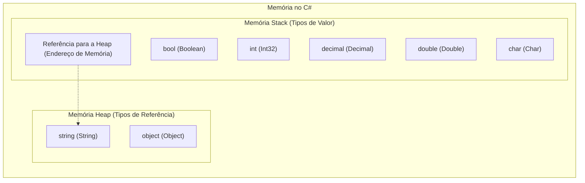
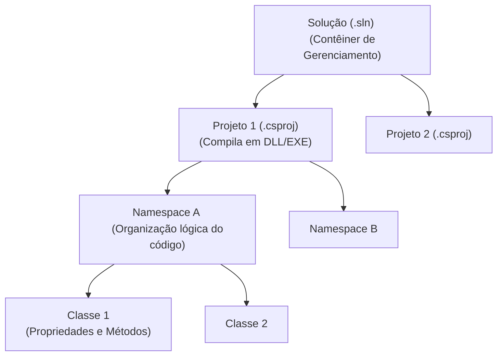
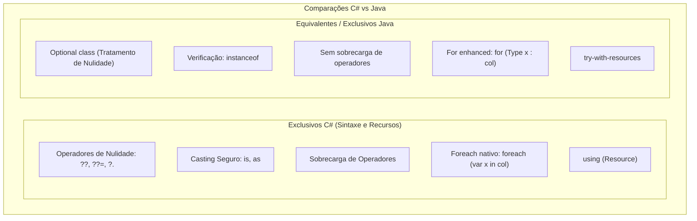

# Meu Guia de Referência C#: Tipos Primitivos, Estruturas e Comparações com Java

Criei este guia de referência para consolidar e aprofundar meus conhecimentos teóricos sobre a linguagem C#, destacando as diferenças práticas com o Java e detalhando a arquitetura dos projetos no ecossistema .NET.

---

## 📊 1. Tipos de Dados Primitivos no C#

No C#, os tipos primitivos são divididos em **Tipos de Valor** (Value Types, armazenados diretamente na Stack) e **Tipos de Referência** (Reference Types, armazenados na Heap com a referência na Stack). Todos os tipos numéricos e lógicos primitivos em C# mapeiam para estruturas (structs) do namespace `System`.

| Tipo C# | Tipo .NET | Categoria | Tamanho | Valor Padrão | Exemplo de Uso Real |
| :--- | :--- | :--- | :--- | :--- | :--- |
| **`bool`** | `System.Boolean` | Valor | 1 byte | `false` | Status de ativação de conta (`bool isUserActive`) |
| **`byte`** | `System.Byte` | Valor | 1 byte (0 a 255) | `0` | Manipulação de arquivos binários ou imagens (`byte[] imageBytes`) |
| **`char`** | `System.Char` | Valor | 2 bytes (Unicode) | `\0` | Iniciais de nomes ou caracteres únicos de menu (`char userOption`) |
| **`short`** | `System.Int16` | Valor | 2 bytes | `0` | Quantidade pequena em estoque local (`short stockQuantity`) |
| **`int`** | `System.Int32` | Valor | 4 bytes | `0` | IDs de banco de dados ou idades (`int userId`) |
| **`long`** | `System.Int64` | Valor | 8 bytes | `0L` | Contador de ticks ou tamanhos de arquivos grandes (`long fileSizeBytes`) |
| **`float`** | `System.Single` | Valor | 4 bytes | `0.0f` | Coordenadas 3D e motores físicos (`float velocityX`) |
| **`double`** | `System.Double` | Valor | 8 bytes | `0.0d` | Coordenadas de GPS de alta precisão (`double latitude`) |
| **`decimal`** | `System.Decimal` | Valor | 16 bytes | `0.0m` | Transações financeiras e moedas (`decimal productPrice`) |
| **`string`** | `System.String` | Referência | Variável | `null` | Nomes, emails e payloads de texto (`string email`) |
| **`object`** | `System.Object` | Referência | Variável | `null` | Payload genérico ou reflexão (`object rawPayload`) |

---

## ⚡ 2. Comparação de Operadores: Java vs C#

A grande maioria dos operadores aritméticos, relacionais e lógicos básicos são idênticos em ambas as linguagens. No entanto, o C# traz facilidades de sintaxe para lidar com nulidade e tipos que facilitam o dia a dia.

### Operadores Exclusivos ou Diferentes em C#

1. **Operadores de Nulidade (`??`, `??=`, `?.`)**:
   * No C#, utilizo `??` (null-coalescing) para atribuir um valor padrão se a expressão for nula:
     ```csharp
     string displayName = inputName ?? "Guest";
     ```
   * O operador `?.` (null-conditional) acessa membros de forma segura sem lançar `NullReferenceException`:
     ```csharp
     int? length = user?.Name?.Length;
     ```
   * O Java não possui esses operadores nativos, exigindo blocos `if` ou a classe `Optional`.

2. **Verificação de Tipo com `is` e `as`**:
   * No C#, uso `is` para checar se um objeto é de determinado tipo (com suporte a pattern matching direto) e `as` para tentar fazer um cast seguro (retornando `null` em caso de falha, em vez de disparar uma exceção):
     ```csharp
     if (obj is string text) { Console.WriteLine(text.ToUpper()); }
     var stream = obj as MemoryStream; // Se falhar, stream será null
     ```
   * No Java, a verificação equivalente é feita via `instanceof` e o casting seguro requer verificação manual prévia.

3. **Sobrecarga de Operadores (Operator Overloading)**:
   * No C#, posso definir comportamentos customizados para operadores matemáticos (como `+`, `-`, `==`) em minhas classes. O Java não suporta sobrecarga de operadores.

---

## 🏛️ 3. A Relação entre Solução, Projeto, Namespace e Classe

Entender a hierarquia de organização no .NET é crucial para estruturar meus códigos corretamente:

1. **Solução (`Solution` / `.sln`)**: O contêiner de nível mais alto. Ele não contém código diretamente; serve apenas para agrupar e gerenciar um ou mais projetos relacionados, facilitando a compilação conjunta e dependências.
2. **Projeto (`Project` / `.csproj`)**: Representa a unidade básica de compilação. Um projeto compila em um único "Assembly" (um arquivo executável `.exe` ou biblioteca `.dll`). Ele contém arquivos de configuração, dependências NuGet e arquivos de código.
3. **Namespace**: Uma forma lógica de organizar os arquivos e evitar conflitos de nomes dentro dos projetos. Equivale aos pacotes (`packages`) do Java.
4. **Classe (`Class`)**: O bloco de construção fundamental do código orientado a objetos, onde defino dados (propriedades) e comportamentos (métodos).

---

## 🔄 4. Controle de Fluxo e Operadores Condicionais: Java vs C#

A estrutura geral de controle de fluxo (`if-else`, `while`, `do-while`, `for`) é idêntica em sintaxe nas duas linguagens. Porém, destaco as seguintes variações importantes:

* **Sintaxe do Loop Foreach**:
  * Em C#, uso a palavra-chave explícita `foreach`:
    ```csharp
    foreach (var item in collection) { ... }
    ```
  * Em Java, uso o laço enhanced `for`:
    ```java
    for (Type item : collection) { ... }
    ```
* **Expressão `switch` avançada (Pattern Matching)**:
  * O C# introduziu o `switch expression`, que me permite escrever condicionais extremamente concisos que retornam valores diretamente:
    ```csharp
    string description = value switch {
        1 => "One",
        2 => "Two",
        _ => "Other"
    };
    ```
  * O Java implementou o switch expression e pattern matching em versões mais recentes (Java 14+), mas o C# tem uma sintaxe e integração de propriedades (`is Point { X: 0 }`) mais abrangente.
* **O Comando `goto`**:
  * O C# suporta o comando `goto` para saltar para marcadores dentro do código (muito usado em desvios específicos de blocos `switch`). O Java reserva a palavra `goto` mas não permite seu uso.
* **Gerenciamento de Recursos (`using` vs `try-with-resources`)**:
  * Em C#, para garantir que recursos descartáveis (como streams e arquivos) sejam liberados da memória, uso a diretiva `using`:
    ```csharp
    using (var stream = new MemoryStream()) { ... } // chama Dispose() automaticamente ao final
    ```
  * Em Java, utilizo a sintaxe `try-with-resources`:
    ```java
    try (MemoryStream stream = new MemoryStream()) { ... } // chama close() automaticamente
    ```

---

## 🎨 5. Diagramas Visuais (Mermaid)

### Diagrama 1: Alocação de Tipos de Dados na Memória (Stack vs Heap)
Este diagrama ilustra como os tipos primitivos que estudei se dividem entre a memória Stack (Tipos de Valor) e Heap (Tipos de Referência).



### Diagrama 2: Estrutura Organizacional do .NET
Representação de como uma Solução agrupa meus projetos e como estes organizam o código lógico em namespaces e classes.



### Diagrama 3: Comparação de Operadores e Fluxo (C# vs Java)
Resumo comparativo dos recursos de operadores e controle de fluxo exclusivos de cada linguagem.


